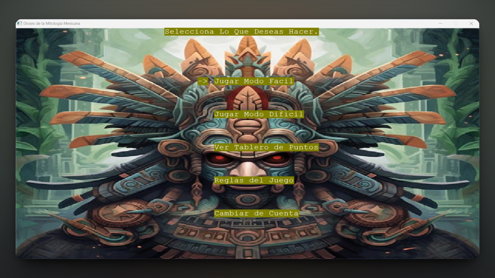

<h1 align="center">Puzzle Game Based on Mexican Mythology — C/C++ 🧩</h1>
<p align="left">
  <a href="README_ES.md" target="_blank">
    Ver README en Español
  </a>
</p>
<p>This repository contains the source code and related files of my final project for the Programming 2 course. The project is a puzzle game inspired by Mexican mythology, offering two levels of difficulty, a login and registration system, and persistent score tracking through file handling. Developed using C and C++, this game showcases advanced programming skills in file manipulation, data structures, and user input validation. The main objective of the project was to apply advanced programming techniques by building an interactive game that handles user data, difficulty settings, and persistent scores through efficient file operations and structured logic.</p>
<h1 align="center">Technologies Used</h1>
<div align="center">
  
  
</div>
<hr>
<h1 align="center">Objective</h1>
<ul>
  <li>Design and implement a complete game system with user profiles and difficulty options.</li>
  <li>Practice file input/output for saving user accounts and scores.</li>
  <li>Implement structured programming with clean modular code using structs and queues.</li>
  <li>Ensure a consistent user experience through solid input validation and error handling.</li>
</ul>
<hr>
<h1 align="center">Main Features</h1>
<ul>
  <li><b>Advanced File Handling:</b> User data and game scores are stored and retrieved from text files, enabling persistent game sessions.</li>
  <li><b>Difficulty Levels:</b> Two levels of difficulty are available to accommodate different player skill levels, offering a fun and scalable challenge.</li>
  <li><b>Login & Registration System:</b> Players can create and manage accounts, with secure validation to prevent duplicate usernames.</li>
  <li><b>Robust Input Validation:</b> Ensures that all inputs are valid, usernames are unique, and game data remains consistent across sessions.</li>
  <li><b>Cultural Theme:</b> Inspired by Mexican mythology, adding an educational and thematic layer to the gameplay.</li>
</ul>
<hr>
<h1 align="center">Skills Acquired</h1>
<ul>
  <li>Advanced <b>C/C++ file management</b> techniques</li>
  <li>Implementation of <b>lists, queues, and structs</b></li>
  <li>Development of <b>console UI/UX</b> logic</li>
  <li>Design of <b>authentication and session systems</b></li>
  <li>Debugging and validating user input for stability</li>
</ul>
<hr>

### How to Use

1. Clone this repository to your local machine:

   ```sh
   git clone https://github.com/jordanmedinaortiz/mexican-mythology-puzzle.git
   cd mexican-mythology-puzzle
   ```

2. Compile the program using GCC or any compatible C compiler:
   ```sh
   gcc rompecabezasMitologiaMexicana.c -o rompecabezasMitologiaMexicana
   ```

3. Run the program:
   ```sh
   ./rompecabezasMitologiaMexicana
   ```
4. Login or Register

5. Choose Difficulty

6. Enjoy the Game 

<p>This project was developed individually as my final project for the Programming 2. It was an excellent opportunity to deepen my understanding of game development, user session management, and file-based systems using C/C++. I hope it provides inspiration or a starting point for anyone learning about system-based console applications.</p>

